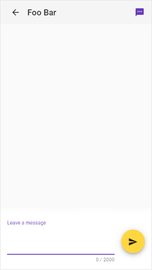
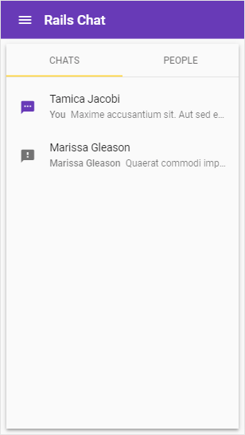
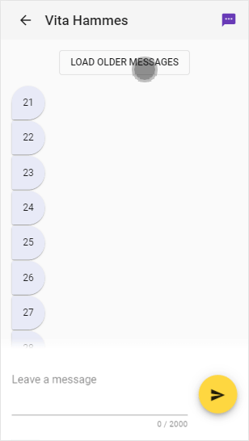
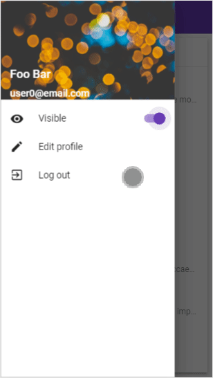
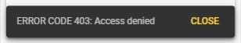
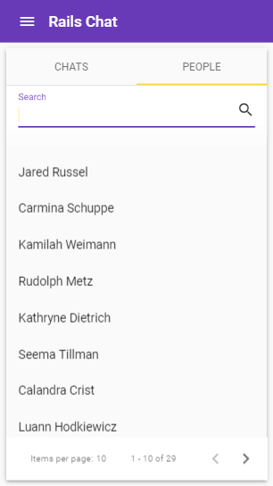

# Rails Chat (frontend)

[Link to app](https://nmacawile.github.io/rails-chat)

[API backend repository](https://github.com/nmacawile/rails-chat-api)

A chat app developed with Ruby on Rails API backend and Angular frontend. It uses Rails' ActionCable to maintain a persistent connection between the chat server and the end users. Angular and Angular Material were used create an interactive and nice looking user interface.

## Features

### Send and receive messages in real-time



### Receive live notifications for new messages



### View older messages



### Appear 'offline ' from other users



> Offline users have a gray dialog icon  next to their name
>
> Online users have a purple dialog icon  next to their name

### Security

Chat instances are protected in the server.



### Search users



## Running locally

Create a file called `environment.ts` inside the `src/environments` directory with this code:

```ts
// environments/environment.ts

const domain = 'localhost:3000';

export const environment = {
  production: false,
  domain,
  url: `http://${domain}`,  
  cableUrl: `ws://${domain}/cable`,
};

```

Replace the `domain` value with the domain of the server.

For the production build, create `environment.prod.ts` in the `src/environments` directory with this code:

```ts
// environments/environment.prod.ts

const domain = 'rails-chat-api.aaaa.bbb';

export const environment = {
  production: true,
  domain,
  url: `https://${domain}`,  
  cableUrl: `ws://${domain}/cable`,
};

```

Replace the `domain` value with the domain of the server.
